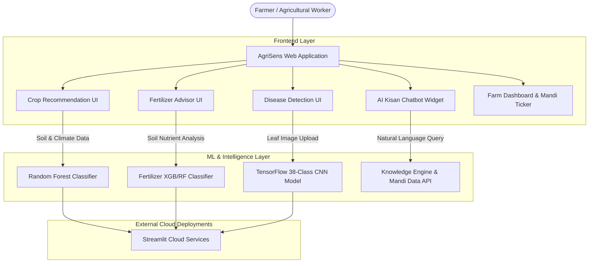

# AgriNex - Smart Agricultural Intelligence System 🌾

[](https://python.org)
[](https://streamlit.io)
[](https://tensorflow.org)
[](https://scikit-learn.org)
[](https://opensource.org/licenses/MIT)
[](https://github.com/)

**AgriNex** is an end-to-end, multi-modal agricultural intelligence platform leveraging machine learning, deep neural networks, and interactive web tools to empower modern precision farming. The system brings predictive analytics directly to farmers and agricultural extension workers through intuitive dashboards and live deployed microservices.


## 🌾 Overview

AgriNex combines cutting-edge AI/ML technologies with user-friendly web interfaces to help farmers make data-driven decisions about crop selection, disease management, and fertilizer optimization. The platform integrates multiple machine learning models trained on agricultural datasets to provide accurate and actionable insights.

## 📌 Table of Contents

- [Overview](#-overview)
- [Deployed Live Streamlit Applications](#-deployed-live-streamlit-applications)
- [System Architecture & Workflow](#-system-architecture--workflow)
- [Features](#-features)
- [Tech Stack](#-tech-stack)
- [Project Structure](#-project-structure)
- [Getting Started](#-getting-started)
- [Model Details](#-model-details)
- [Usage Examples](#-usage-examples)
- [Dataset Information](#-dataset-information)
- [Contributing](#-contributing)
- [License](#-license)
  

## 🚀 Deployed Live Streamlit Applications

AgriNex trained machine learning models are deployed live on Streamlit Cloud:
- 🌾 **Crop Recommendation AI**: [smart-crop-recommendations.streamlit.app](https://smart-crop-recommendations.streamlit.app/)
- 🧪 **Fertilizer Prediction AI**: [fertilizer-predictions.streamlit.app](https://fertilizer-predictions.streamlit.app/)
- 🔬 **Plant Disease Identification**: [plant-diseases-identification.streamlit.app](https://plant-diseases-identification.streamlit.app/)

## 🏗️ System Architecture & Workflo


## ✨ Features & Capabilities

- **Embedded Streamlit ML Apps**: Real-time interactive model predictions seamlessly embedded inside responsive web interfaces (`crop-prediction.html`, `fertilizer.html`, `disease-detection.html`).
- **Universal AI Kisan Chatbot**: Multi-lingual floating conversational assistant tailored for localized agricultural advice, weather alerts, disease remedies, and APMC market prices.
- **Precision Crop Recommendation Engine**: High-accuracy crop selection powered by Random Forest algorithms analyzing Nitrogen (N), Phosphorus (P), Potassium (K), temperature, relative humidity, pH, and annual rainfall.
- **Computer Vision Plant Pathology**: Deep convolutional neural network (CNN) capable of identifying 38 distinct crop diseases across 14 plant species with leaf image uploaded via web interface.
- **Soil-Specific Fertilizer Advisor**: Automated fertilizer dosage calculation matching crop requirements against current NPK depletion metrics to avoid over-fertilization.
- **Live APMC Mandi Ticker & Government Schemes**: Real-time wholesale commodity price ticker and curated catalog of PM-KISAN, KCC, and state agricultural subsidies.
- **Farm Management Telemetry Dashboard**: Complete farm monitoring hub with 7-day weather forecasting, spray-window advisory, yield revenue estimate tools, and direct Krishi Vigyan Kendra (KVK) contacts.

## 🛠️ Tech Stack

### Frontend
- **React.js** - Interactive user interface
- **HTML/CSS/JavaScript** - Web standards

### Backend & ML Services
- **Python** - Core language for ML/AI services
- **Streamlit** - Framework for data apps and model serving
- **Flask** - Web framework for APIs

### Machine Learning & AI
- **TensorFlow** - Deep learning framework
- **Keras** - Neural network API for plant disease identification
- **scikit-learn** - Machine learning algorithms for crop and fertilizer prediction
- **Random Forest Classifier** - Ensemble learning for crop recommendation

### Data Processing & Visualization
- **Pandas** - Data manipulation and analysis
- **NumPy** - Numerical computing
- **Matplotlib** - 2D plotting and visualization
- **Seaborn** - Statistical data visualization
- **OpenCV** - Computer vision for image processing

### Datasets
- **PlantVillage Dataset** - 38 plant disease classes
- **Crop Recommendation Dataset** - Soil and environmental parameters
- **Fertilizer Recommendation Dataset** - Soil nutrient analysis

## 📁 Project Structure

```
AgriNex/
├── CROP PREDICT/                          # React frontend + ML model training
│   ├── frontend/                          # React application
│   │   ├── public/
│   │   │   ├── index.html
│   │   │   └── manifest.json
│   │   └── src/
│   │       ├── App.js
│   │       ├── home.js
│   │       ├── index.js
│   │       └── index.css
│   ├── saved_model/                       # Pre-trained crop prediction models
│   │   ├── model_v1.h5
│   │   ├── model_v2.h5
│   │   └── model_v3.h5
│   └── training/
│       ├── model.ipynb                    # Model training notebook
│       └── PlantVillage/                  # Training dataset
│
├── CROP-RECOMMENDATION/                   # Streamlit crop recommendation app
│   ├── webapp.py                          # Main Streamlit application
│   ├── Crop_recommendation.csv            # Dataset
│   ├── requirements.txt
│   └── fgd.html
│
├── PLANT-DISEASE-IDENTIFICATION/          # Streamlit disease detection app
│   ├── main.py                            # Main Streamlit application
│   ├── trained_plant_disease_model.keras  # Trained Keras model
│   ├── Train_plant_disease.ipynb          # Training notebook
│   ├── Test_plant_disease.ipynb           # Testing notebook
│   ├── training_hist.json                 # Training history
│   ├── settings.json                      # Configuration
│   ├── requirements.txt
│   └── test/                              # Test images
│
├── fertilizer_prediction/                 # Fertilizer prediction module
│   └── fertilizer_prediction/
│       ├── fert.py                        # Fertilizer prediction script
│       ├── p1.ipynb                       # Analysis notebook
│       ├── data_core.csv                  # Dataset
│       └── requirements.txt
│
├── Datasets/                              # Consolidated datasets
│   ├── Crop_recommendation.csv
│   ├── Fertilizer_recommendation.csv
│   ├── README.md
│   └── PlantVillage/                      # Plant disease images
│       ├── Potato___healthy/
│       ├── Potato___Late_blight/
│       └── [38+ disease classes]
│
└── AgriSens-web-app/                      # Integrated web application
```

## 🚀 Getting Started

### Prerequisites
- Python 3.8+
- Node.js 14+ (for frontend web apps)
- Docker & Docker Compose (optional for containerized setup)
- `pip` / `venv` or `conda` for environment isolation
- Git

### Quick Setup with Virtual Environment

#### 1. Clone the Repository
```bash
git clone https://github.com/SQUADRON-LEADER/AgriNex.git
cd AgriNex
```

#### 2. Environment Setup (Recommended)
```bash
# Create and activate virtual environment
python -m venv venv

# On Windows
.\venv\Scripts\activate

# On Linux/macOS
source venv/bin/activate
```

#### 3. Setup & Run Crop Recommendation Microservice
```bash
cd CROP-RECOMMENDATION
pip install -r requirements.txt
streamlit run webapp.py
```
*Access interface at `http://localhost:8501`*

#### 4. Setup & Run Plant Disease Detection Microservice
```bash
cd ../PLANT-DISEASE-IDENTIFICATION
pip install -r requirements.txt
streamlit run main.py --server.port 8502
```
*Access interface at `http://localhost:8502`*

#### 5. Setup & Run Fertilizer Advisor Microservice
```bash
cd ../fertilizer_prediction/fertilizer_prediction
pip install -r requirements.txt
python fert.py
```

#### 6. Launch AgriSens Integrated Web Portal
```bash
cd ../AgriSens-web-app
# Open index.html directly in browser or serve via npx http-server
npx http-server -p 8080
```

### 🐳 Containerized Deployment (Docker)

```bash
# Build and run containers via Docker Compose
docker-compose up --build -d
```

## 📊 Model Details

### Crop Recommendation Model
- **Algorithm**: Random Forest Classifier
- **Features**: N, P, K (soil nutrients), Temperature, Humidity, pH, Rainfall
- **Output Classes**: 22 different crops (Rice, Maize, Chickpea, Kidney Beans, Pigeon Peas, Moth Beans, Mung Bean, Black Gram, Lentil, Pomegranate, Banana, Mango, Grapes, Watermelon, Muskmelon, Apple, Orange, Papaya, Coconut, Cotton, Jute, Coffee)
- **Accuracy**: ~99% cross-validation accuracy
- **Training Data**: 2,200+ soil & climate sample observations

#### 🧪 Input Parameter Specifications Table

| Feature Parameter | Symbol | Measurement Unit | Typical Value Range | Description |
| :--- | :---: | :---: | :---: | :--- |
| **Nitrogen** | `N` | ratio / mg/kg | 0 - 140 | Soil ratio of Nitrogen content |
| **Phosphorus** | `P` | ratio / mg/kg | 5 - 145 | Soil ratio of Phosphorus content |
| **Potassium** | `K` | ratio / mg/kg | 5 - 205 | Soil ratio of Potassium content |
| **Temperature** | `temp` | °C | 8.8 - 43.7 | Ambient atmospheric temperature |
| **Humidity** | `humidity` | % | 14.3 - 99.9 | Relative air humidity percentage |
| **pH Level** | `ph` | pH scale | 3.5 - 9.9 | Acidity / alkalinity index of soil |
| **Rainfall** | `rainfall` | mm | 20.2 - 298.6 | Cumulative seasonal rainfall |

### Plant Disease Detection Model
- **Framework**: TensorFlow / Keras 2.x
- **Architecture**: Convolutional Neural Network (CNN) with Softmax classification layer
- **Input Dimensions**: 128x128 pixel RGB tensor
- **Output Classes**: 38 distinct plant pathology classes
- **Supported Crops**: Apple, Blueberry, Cherry, Corn, Grape, Orange, Peach, Pepper, Potato, Raspberry, Soybean, Squash, Strawberry, Tomato

### Fertilizer Prediction Model
- **Algorithm**: Machine Learning Classifier (Random Forest / XGBoost hybrid)
- **Features**: Soil NPK baseline, soil type, crop type, humidity, temperature
- **Output**: Optimized target fertilizer blend (e.g., Urea, DAP, 14-35-14, 28-28, 17-17-17, 20-20, 10-26-26) with calculated application rate

## 💻 Usage Examples

### Crop Recommendation
```python
Input: N=90, P=42, K=43, Temperature=20.87, Humidity=82.00, pH=6.5, Rainfall=202.9
Output: Recommendation for "Maize" crop
```

### Disease Detection
```python
Input: Plant leaf image
Output: Disease identified with confidence score
Example: "Potato___Late_blight - 95% confidence"
```

### Fertilizer Recommendation
```python
Input: Soil parameters and crop type
Output: Specific fertilizer recommendation with dosage
```

## 📈 Dataset Information

- **PlantVillage Dataset**: 61,486 images across 38 disease classes
- **Crop Dataset**: Features covering 22 different crops with environmental parameters
- **Fertilizer Dataset**: Comprehensive soil and crop parameters with recommendations

## 🤝 Contributing

Contributions are welcome! Please follow these steps:

1. Fork the repository
2. Create your feature branch (`git checkout -b feature/AmazingFeature`)
3. Commit your changes (`git commit -m 'Add some AmazingFeature'`)
4. Push to the branch (`git push origin feature/AmazingFeature`)
5. Open a Pull Request

## 📝 Model Training & Evaluation

To retrain or evaluate models:

### Crop Prediction
```bash
cd CROP\ PREDICT/training
jupyter notebook model.ipynb
```

### Plant Disease Detection
```bash
cd PLANT-DISEASE-IDENTIFICATION
jupyter notebook Train_plant_disease.ipynb
```

## 🔧 Configuration

Each service has a `settings.json` or configuration file for model parameters and settings. Modify these files to adjust:
- Model paths
- Input parameters
- Output formats
- Service ports

## 📦 Dependencies

See individual `requirements.txt` files in each module directory for specific dependencies:
- Core ML dependencies: TensorFlow, Keras, scikit-learn
- Data processing: Pandas, NumPy
- Visualization: Matplotlib, Seaborn
- Web frameworks: Streamlit, Flask
- Image processing: OpenCV, Pillow

## 🐛 Troubleshooting

### Model Loading Issues
- Ensure model files (.keras, .h5) are in the correct directories
- Verify TensorFlow and Keras versions match training environment

### Streamlit Port Already in Use
```bash
streamlit run app.py --server.port 8503
```

### Missing Dependencies
```bash
pip install --upgrade -r requirements.txt
```

## 📄 License

This project is licensed under the MIT License - see the LICENSE file for details.

## 👥 Team & Credits

AgriNex is developed as an agricultural AI solution combining expertise in:
- Machine Learning & Deep Learning
- Agricultural Science
- Full-Stack Web Development

## 📞 Support

For issues, questions, or suggestions:
1. Open an issue on GitHub
2. Check existing documentation
3. Review dataset README files for data-specific questions

## 🌱 Future Enhancements & Strategic Roadmap

- [x] **Multi-modal Web Dashboard Integration**: Unified interface for crop recommendation, disease detection, and fertilizer calculation.
- [x] **Live Streamlit Cloud Deployment**: Microservices published live for testing and remote inference.
- [ ] **Hyper-local Weather & Microclimate API**: Integrate OpenWeatherMap API for live rainfall and moisture forecast alerts.
- [ ] **Real-time Commodity Price Forecasting**: Time-series predictive models for APMC market trends.
- [ ] **Native Mobile Application (React Native)**: Offline-first mobile app for field operation with localized camera scan.
- [ ] **Regional Language Localization**: Support for Hindi, Marathi, Punjabi, Tamil, Telugu, and Kannada.
- [ ] **IoT Sensor Grid Integration**: Direct Bluetooth / LoRaWAN telemetry ingestion from soil NPK hardware probes.

---

<p align="center">
  <b>AgriNex</b> • Empowering Sustainable Farming with Artificial Intelligence<br>
  Developed with ❤️ for farmers, agronomists, and precision agriculture worldwide.
</p>
